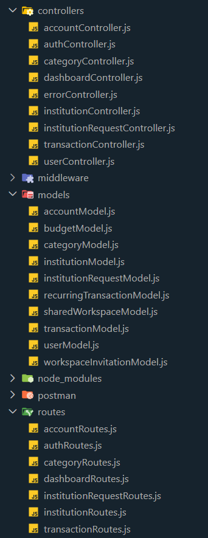
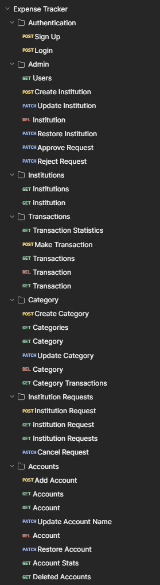
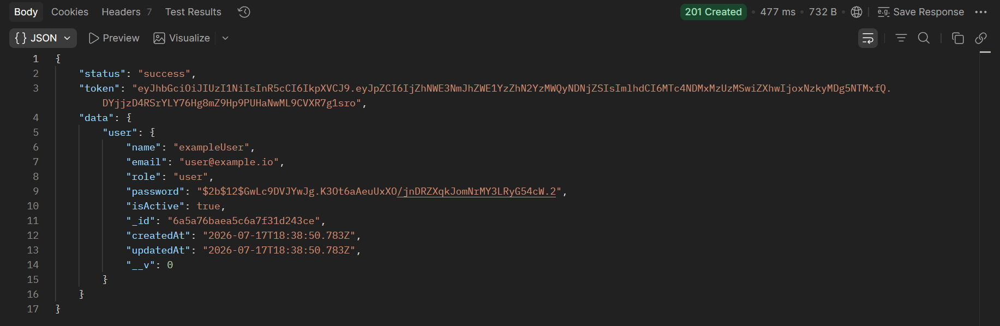
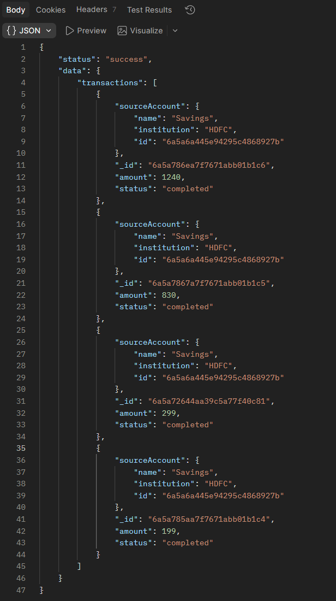
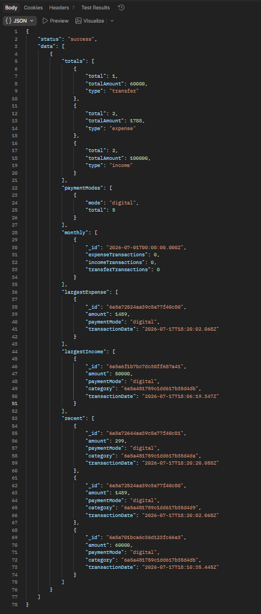

# Expense Tracker REST API

A production-ready REST API for managing personal finances, accounts, transactions and categories.

## Features

- JWT Authentication
- Role-Based Authorization
- Multiple Financial Accounts
- Financial Institution Management
- Institution Request Workflow
- Transaction Management
- Categories
- Soft Delete & Restoration
- Transaction Statistics
- Aggregation Pipelines
- Search
- Filtering
- Sorting
- Pagination
- Field Limiting
- Global Error Handler
- MongoDB Transactions

## Tech Stack

- **Runtime:** Node.js
- **Framework:** Express.js
- **Database:** MongoDB
- **ODM:** Mongoose
- **Authentication:** JWT
- **Password Hashing:** bcrypt

## Screenshots

#### Folder Structure



#### Postman Collection



#### Sign Up Response



#### API Features

`GET /expense-tracker/v1/transactions?search=HDFC&transactionType=expense&sort=-amount,transactionDate&fields=sourceAccount,destinationAccount,amount,status&page=2&limit=5`



#### Transaction Statistics



### Architecture

The project follows a modular MVC architecture, separating business logic, routing, database models, middleware and utility functions into independent modules. This structure improves maintainability, scalability and code reusability while keeping each component focused on a single responsibility.

## Installation

### 1. Clone the repository

```bash
git clone https://github.com/Divyansh374/Expense-Tracker-API.git
cd Expense-Tracker
```

### 2. Install dependencies

```bash
npm install
```

### 3. Configure environment variables

Create a `config.env` file in the project root and add the following variables:

```env
NODE_ENV=development

PORT=3000

DATABASE=<your-mongodb-connection-string>
DATABASE_PASSWORD=<your-password>

JWT_SECRET=<your-secret-key>
JWT_EXPIRES_IN=90d
```

### 4. Start the development server

```bash
npm run start
```

The API will be available at:

```
http://localhost:3000
```

## Testing with Postman

The repository includes a complete Postman collection and environment to simplify API testing.

### Import into Postman

1. Open Postman.
2. Click **Import**.
3. Import the following files from the `postman/` directory:
   - `Expense-Tracker.postman_collection.json`
   - `Dev-Expense-Tracker.postman_environment.json`

## Authentication

This API uses **JSON Web Tokens (JWT)** for authentication.

1. Sign up or log in to receive a JWT.
2. Store the token in your API client (e.g., Postman environment variable).
3. Include the token in the `Authorization` header of protected requests.

```
Authorization: Bearer <your-jwt-token>
```

### Postman Automation

The included Postman collection automatically stores the JWT after a successful login using the following script:

```javascript
pm.environment.set("jwt", pm.response.json().token);
```

This allows all subsequent protected requests to use the latest token automatically.

## API Endpoints

### Authentication

- POST /users/signup
- POST /users/login

### Institutions

- POST /institutions
- GET /institutions
- GET /institutions/:id
- PATCH /institutions/:id
- DELETE /institutions/:id
- PATCH /institutions/:id/restore

### Institution Requests

- POST /institution-requests
- GET /institution-requests
- GET /institution-requests/:id
- PATCH /institution-requests/:id/approve
- PATCH /institution-requests/:id/reject
- PATCH /institution-requests/:id/cancel

### Accounts

- POST /accounts
- GET /accounts
- GET /accounts/:id
- PATCH /accounts/:id
- DELETE /accounts/:id
- PATCH /accounts/:id/restore
- GET /accounts/stats
- GET /accounts/deleted

### Transactions

- POST /transactions
- GET /transactions
- GET /transactions/:id
- DELETE /transactions/:id
- GET /transactions/stats

### Categories

- POST /categories
- GET /categories
- GET /categories/:id
- PATCH /categories/:id
- DELETE /categories/:id
- GET /categories/:id/transactions

## Query Features

Most GET endpoints support advanced querying through URL parameters.

### Filtering

```
GET /transactions?transactionType=expense&paymentMode=cash
```

### Sorting

```
GET /transactions?sort=-amount,date
```

### Field Limiting

```
GET /transactions?fields=title,amount,date
```

### Pagination

```
GET /transactions?page=2&limit=10
```

### Search

```
GET /transactions?search=Food
```

## Error Handling

The API uses a centralized global error handler.

Operational errors return consistent JSON responses with appropriate HTTP status codes.

Example:

```json
{
  "status": "fail",
  "message": "Account not found."
}
```

## Project Highlights

- JWT-based authentication and authorization
- MongoDB transactions for atomic balance updates
- Aggregation pipelines for financial analytics
- Generic API Features utility (filtering, sorting, pagination, search)
- Soft deletion and restoration
- Reusable global error handling
- Modular MVC architecture

## Future Improvements

- Expense Tracker frontend built with React and TypeScript
- Budget management
- Recurring transactions
- Shared Workspaces with Invitations
- Email notifications
- Charts and dashboards
